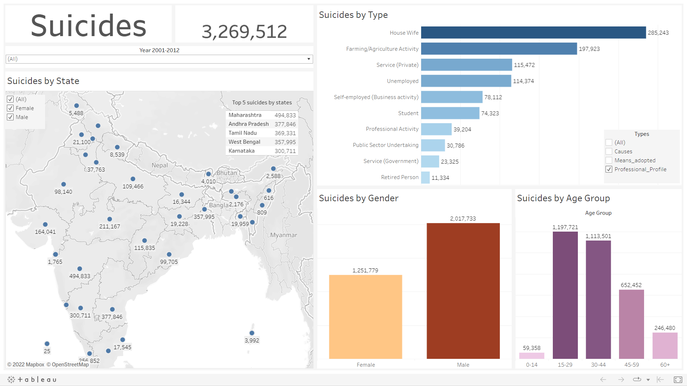

# Indian Suicide Analysis

Analysis of suicides in India from year 2001 to 2012.

## Tech Stack


## Download

```bash
  git clone https://github.com/adionmission/Indian-Suicide-Analysis.git
```

## About

The original procedures uses python and jupyter for analysis which never explained the logic for there analysis and the jupyter notebook never provided any dashboard for presentable analysis.

The dataset consists of approx 200,000 rows and thus SQL was used to perform data insights process. But cleaning data with SQL gets complicated as you have to write too complex queries.

Too much of manual work you know.

A more robust approach needs to be applied. Now here comes the role on R where you just need to define a function in a pipline.

## Data Pipeline in R

```r
  data_clean = df %>%
    na_if("Total (States)") %>%
    na_if("Total (All India)") %>%
    na_if("Total (Uts)") %>%
    na_if("Others (Please Specify)") %>%
    na_if("Other Causes (Please Specity)") %>%
    na_if("By Other means") %>%
    na_if("By Other means (please specify)") %>%
    na_if("Causes Not known") %>%
    na_if("0-100+") %>%
    drop_na()
```

## About Dataset

The dataset is about the suicides incidents happed from year 2001 to 2012. Following are the parameters:

| Parameters        | Data Type                                                          |
| ----------------- | ------------------------------------------------------------------ |
| State | Character |
| Year | Numeric |
| Type_code | Character |
| Type | Character |
| Gender | Character |
| Age_group | Character |
| Total | Numeric |

## Original Methodology
 - Data insights using Python.
 - Data cleaning using Python.
 - Data visualization using Python.

## My Methodology
 - Data insights using SQL.
 - Data cleaning using R programming.
 - Data visualization using Tableau.

## Data Cleaning

There was some unlogical data filled which does not made sense. Not ever 0.1%. So, those values were removed through above pipeline.
Further, some redundant data existed, so changed those values.

```r
  data_clean$State[data_clean$State == "Delhi (Ut)"] = "Delhi"
  data_clean$Type[data_clean$Type == "Divorcee"] = "Divorce"
```

Second time the data cleaning was performed in order to remove special symbols if existed.

```r
  dataclean = data_clean %>%
    janitor::clean_names()
```

## Visualizations



## Acknowledgements

 - [Dataset](https://www.kaggle.com/datasets/rajanand/suicides-in-india)
